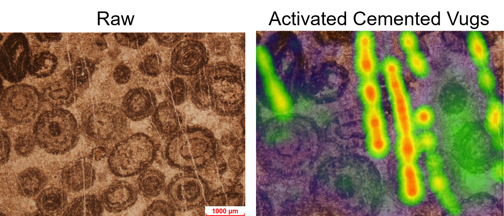

  
  
&nbsp;

  

    <b>AI4Geoscience Research Group
  

[🛠️What's New]
[📘Group Introduction]
[✨Members]
[🚀Ongoing Projects]
[🖊️Papers]

English | [简体中文](README_zh-CN.md)

##  🛠️What's New 

### Articles accepted! \[13/07/2023\]:

Two papers from Keran Li and Shan Ren were accepeted by the Seventh International Conference on Engineering Geophysics (ICEG2023) and would be published on the journal ***Geophysics*** (SCI 2, TOP in geophysics).

<u>Keran Li, Jinmin Song, Lizhou Tian, et al., 2023. Attention Mechanism and Spatial-time Information Assist Well-Logging Lithological Interpretation: An Experiment from Lower Triassic Jialingjiang Formation, East Sichuan Basin, SW China </u>

### Abstract accepted! \[20/06/2023\]:

Three abstracts mainly contributed by Yingjie Ma, Ziayng Zhang and Keran Li were accepted by the Seventh Conference on Earth System Science (CESS2023).

### Members graduated! \[15/06/2023\]:

Keran Li graducated from the College of Energy, Chengdu University of Technology, with a master degree. He will join Dr. Xiumian Hu's research group (Nanjing University) to continue his doctery research.

Shan Ren graducated from the College of Energy, Chengdu University of Technology, with a bachelor degree. She will join Dr. Jinmin Song's research group (Chengdu University of Technology) to continue her mastery research.

### Set up the Github organization of AI4Geoscience \[05/09/2023\]:

To manage our code and cooperate better, we are excited to use <b>git<b> to restore our program 

<a href="#top">🔝Back to top</a>

## 📖 Group Introduction

AI4Geoscience Research Group is an open-source organization which do some jointly resaerches in geosciences and the artificial intelligence (AI). In this group, members mainly majors in <u>***Gesciences***</u>, including <u>***petroleum geology***</u>, <u>***sedimentology***</u> and <u>***geochemistry***</u>. Also, some members also have education background in <u>***Computer Sciences***</u>. 

<a href="#top">🔝Back to top</a>

## ✨ Members

- **Keran Li (Nanjing University, <u>keranli98@outlook.com</u>)

  Nowadays a doctery student who is majoring the academic degree of <u>***Geology***</u> in the College of Earth Science and Engineering, Nanjing University. His reseaches of interests includes <u>***Isotopic geochemistry analysis in the plaeo-ocaen, paleo-climate and paleo-environment***</u> and <u>***Applications of computer vision, data-mining in the sedimentology***</u>.

- **Shan Ren (Chengdu University of Technology, <u>1198481650@qq.com</u>)

  From 09/2023, she will be a mastery student who is majoring the academic degree of <u>***Geo-resources and Geo-engineering***</u> in the College of Energy, Chengdu University of Technology. Her reseaches of interests includes <u>***Data-mining in geochemistry***</u> and <u>***Applications of computer vision***</u>.

- **Chunqiao Yan (Chengdu University of Technology, <u>158527608@qq.com</u>)

  Nowadays a mastery student who is majoring the academic degree of <u>***Geo-resources and Geo-engineering***</u> in the College of Energy, Chengdu University of Technology. His reseaches of interests includes <u>***Isotopic geochemistry analysis in the plaeo-ocaen, paleo-climate and paleo-environment***</u> and <u>***Applications of computer vision, data-mining in the sedimentology***</u>.

- **Ziyang Zhang (Chengdu University of Technology, <u>hafuhafu@qq.com</u>)

  Nowadays a undergraudate student who is majoring **IOT** and **Geo4AI**, in the College of Computer Science and Cyber Security, Chengdu University of Technology. His reseaches of interests includes <u>***DBMS, High Performance Computing, Cloud Data Analyze***</u>. He will finish his master degree at DB Group in Southern University of Science and Technology.
- **Yingjie Ma (Chengdu University of Technology, <u>murinj2248@outlook.com</u>)

  Nowadays a undergraudate student who is majoring **IOT** and **Geo4AI**, in the College of Computer Science and Cyber Security, Chengdu University of Technology. His reseaches of interests includes <u>***Applications of computer vision, Artificial Intelligence of Things, Embedded artificial intelligence***</u>. 

<a href="#top">🔝Back to top</a>

## 🚀 Ongoing Projects

- Evaluating the performance of deep models in a first and professional large-carbonate-images in the microscope

- PPL-to-Cathodoluminescence image translation

- PasseyNet: An Application of the Well-logs-to-TOC Predicting

- Investigation the CV information in the microbialite images

- The comparison of time-series information and stratigraphic-sequeence information

## 🖊️ Papers

Some papers can be seen in the **Researchgate**(https://www.researchgate.net/profile/Keran-Li-3?ev=hdr_xprf)

<a href="#top">🔝Back to top</a>
# .github
